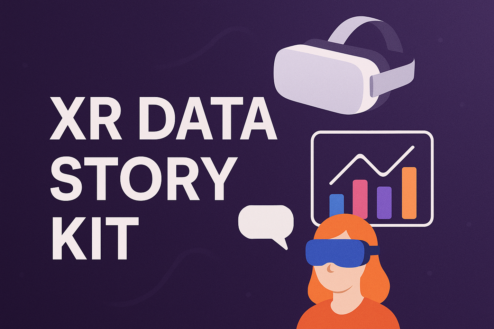

# XR Data Story Kit
 

**XR Data Story Kit** turns datasets (CSV/GeoJSON) into interactive VR stories on a tabletop map in VR. It turns CSV/GeoJSON into an interactive VR narrative experience so scientists can explore spatiotemporal data without rebuilding custom apps. This would improve the visualization and enhance education with minimal Unity development knowledge.
 
#### Our Goals we aim for:
#### 1) Resusable components (interaction, visualization, and data import)
#### 2) Application is easy to use for scientists/educators. 
#### 3) Cross-Platform Device support using OpenXR.
#### 4) Ability to provide the tools for scientists/educators to develop their visualization and storytelling through the app without setting up a development enviorment.
#### 5) Add the ability to view GeoData through Unity's ArcGIS.

## Table of Contents
- [Installation](#Installation)
- [Contribution Guide](#Contribution-Guide)

<a name="Installation"/>

## Installation
### 1. Install Unity Hub and Unity Editor Version 6000.2.2f1 with Android/Windows/Mac build support as needed.
### 2. Clone the repo and open the project.

<a name="Contribution-Guide"/>

## Contribution Guide
* Open an issue or start a discussion for questions/ideas.
* Reports should include when/where the incident happened, who was involved (if known), and any supporting context.
* Please contact me for any conerns or questions.
